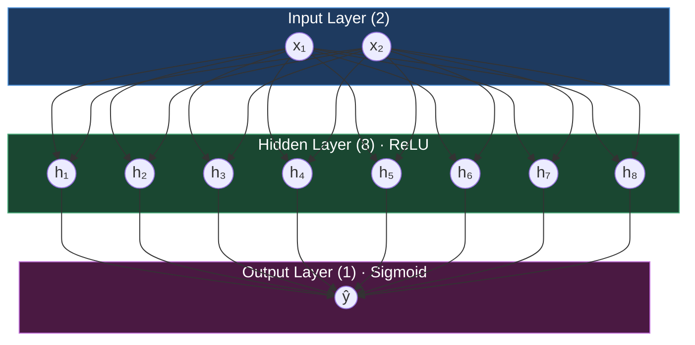
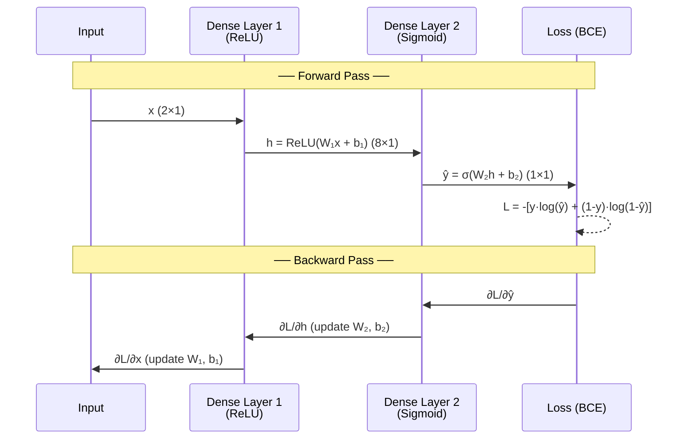
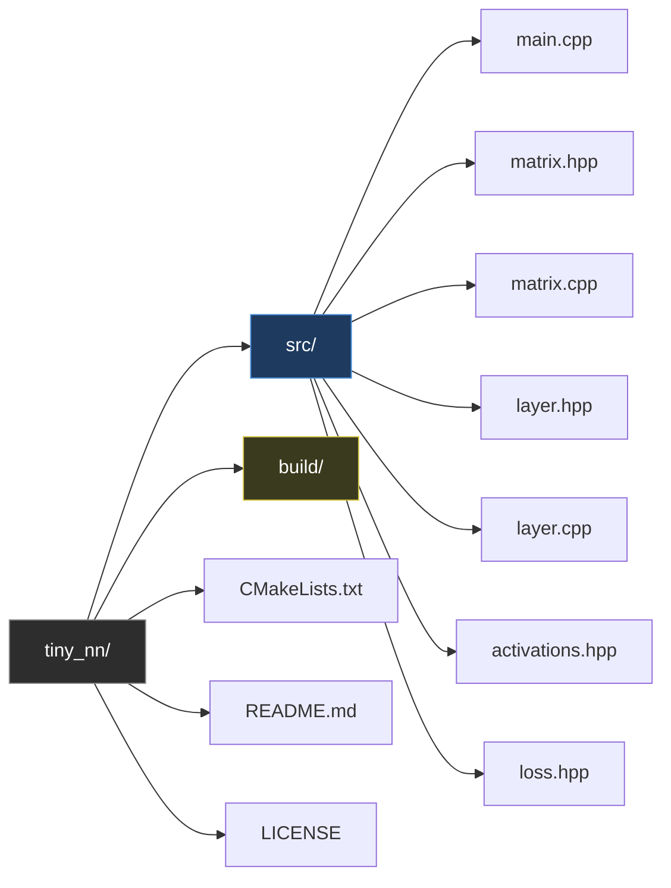
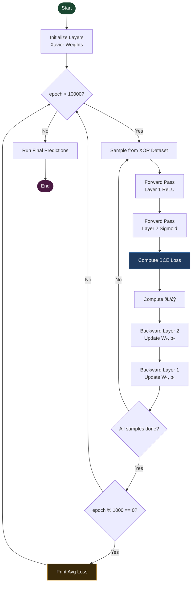

<div align="center">

# 🧠 Tiny Neural Network in C++


**A minimal neural network engine implemented from scratch in modern C++20 — no external ML libraries.**

</div>

---

## ✨ Features

- **Matrix Engine** — Dynamic, row-major matrix class with full operator support
- **Matrix Ops** — Multiplication, transpose, scalar operations
- **Activations** — ReLU, Sigmoid (scalar & element-wise matrix versions)
- **Loss Function** — Binary Cross Entropy with gradient
- **Dense Layer** — Fully connected layer with configurable activation
- **Backpropagation** — Gradient descent with chain rule
- **XOR Example** — Classic non-linear classification problem

---

## 🏗️ Architecture

### Network Topology



### Forward & Backward Pass



---

## 📁 Project Structure



---

## 🚀 Build & Run

```bash
mkdir build
cd build
cmake ..
make
./tiny_nn
```

---

## 📊 Training Flow



---

## 📈 Example Output

```
Epoch 0    Loss: 0.7231
Epoch 1000 Loss: 0.6891
Epoch 2000 Loss: 0.5204
Epoch 3000 Loss: 0.3012
...
Epoch 9000 Loss: 0.0183

Final predictions:
[0,0] → 0.02  ✓
[0,1] → 0.97  ✓
[1,0] → 0.97  ✓
[1,1] → 0.03  ✓
```

---

## 🔭 Future Improvements

| Feature | Status |
|---|---|
| Batch training | 🔲 Planned |
| Softmax + multi-class | 🔲 Planned |
| MNIST dataset | 🔲 Planned |
| SIMD optimization | 🔲 Planned |
| OpenMP parallelization | 🔲 Planned |
| CUDA implementation | 🔲 Planned |

---

<div align="center">

**Author:** [@Yahia995](https://github.com/Yahia995) &nbsp;·&nbsp; **License:** MIT

</div>
